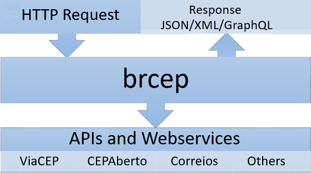
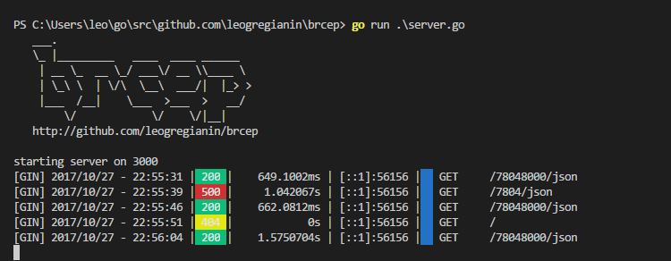

# brcep 

[](https://travis-ci.org/leogregianin/brcep) [](http://goreportcard.com/report/leogregianin/brcep) [](https://github.com/leogregianin/brcep/issues?q=is%3Aopen+is%3Aissue) [](https://github.com/leogregianin/brcep/issues?q=is%3Aissue+is%3Aclosed)

API para acesso a informações dos CEPs do Brasil. A ideia central é não ficar dependente de uma API específica, e sim, ter a facilidade de acessar a __brcep__ e ela se encarrega em consultar diversas fontes e lhe devolver as informações do CEP de forma rápida e fácil.





# Acesso a API

Para visualizar os dados acesse [https://brcep.herokuapp.com/78048000/json](https://brcep.herokuapp.com/78048000/json).

A API retorna o formato JSON (issues abertos para retornar XML e GraphQL).

### Retorno da API

```json
{
  "cep": "78048000",
  "endereco": "Avenida Miguel Sutil, de 5799/5800 a 7887/7888",
  "bairro": "Consil",
  "complemento": "",
  "cidade": "Cuiabá",
  "uf": "MT",
  "ibge": "5103403",
  "latitude": "-15.5786867",
  "longitude": "-56.0952081"
}
```

* O campo "CEP" retorna somente números.
* Os campos "complemento", "latitude" e "longitude" podem retornar em branco dependendo da API retornada.
* Os demais campos sempre retornarão valores desde que o CEP consultado tenha o cadastro completo.

# Exemplos de acesso a API

### curl
```curl
curl https://brcep.herokuapp.com/78048000/json
```

### Javascript/NodeJS
```javascript
var request = require('request');
var options = {
    url: 'https://brcep.herokuapp.com/78048000/json',
    }
};
function callback(error, response, body) {
    if (!error && response.statusCode == 200) {
        var info = JSON.parse(body);
        console.log(info);
    }
}
request(options, callback);
```

### Python
```python
import urllib.request
import json

url = "https://brcep.herokuapp.com/78048000/json"
result = urllib.request.urlopen(url)
data = result.read()
encoding = result.info().get_content_charset('utf-8')
print(json.loads(data.decode(encoding)))
```

### Golang
```go

```

### Ruby
```ruby
require "net/http"
require "uri"
require 'json'

url = "https://brcep.herokuapp.com/78048000/json"
uri = URI.parse(url)

http = Net::HTTP.new(uri.host, uri.port)
http.use_ssl = true if url =~ /^https/

request = Net::HTTP::Post.new(uri.request_uri, 'Content-Type' => 'application/json')
response = http.request(request)
if response.code == "200"
    result = JSON.parse(response.body)
    puts(result)
end
```

### PHP
```php
<?php
    header ( "Content-Type: application/json;charset=utf-8" );
    $url = 'https://brcep.herokuapp.com/78048000/json';
    $json = file_get_contents($url);
    echo $json;
?>
```

### Java
```java

```

### C#
```c#

```

### Delphi
```pascal
uses idHTTP;

procedure TForm1.ButtonCEPClick(Sender: TObject);
var
    HTTP: TIdHTTP;
    Response: TStringStream;
    URL: String;
begin
    URL := 'https://brcep.herokuapp.com/78048000/json';
    MemoReturn.Lines.Clear;
    try
        HTTP := TIdHTTP.Create;
        Response := TStringStream.Create('');
        HTTP.Get(URL, Response);
        if HTTP.ResponseCode = 200 then
           MemoReturn.Text := Utf8ToAnsi( Response.DataString );
    finally
        Response.Free;
        HTTP.Destroy;
    end;
end;
```

# ToDo

- [x] Implementar requisição ao [ViaCEP](http://viacep.com.br) 
- [x] Implementar requisição ao [CEPAberto](http://cepaberto.com)
- [ ] Implementar acesso a outras fontes de CEP (Correios)
- [X] Quando a API do CEPAberto não retornar nada, buscar no ViaCEP
- [X] Após a consulta às APIs retornar um JSON padrão do brcep
- [ ] Implementar interfaces
- [ ] Implementar retorno da API com XML
- [ ] Implementar retorno da API com GraphQL
- [X] Implementar exemplos de uso da API em curl, Javascript, Python, Ruby, PHP e Delphi
- [ ] Implementar exemplos de uso da API em C#, Java e Go
- [X] Arquivo .env define as configurações do ambiente
- [ ] Gravar as informações do CEP consultado em um banco de dados
- [ ] A cada requisição fazer a consulta em thread parallelism (goroutines) em todas as APIs e atualizar o banco de dados
- [ ] Implementar testes unitários


# Rodar localmente

### Instalação do Golang

Instalar o Golang [https://golang.org/dl](https://golang.org/dl).

### Instalação dos pacotes

```sh
go get -u github.com/gin-gonic/gin
go get -u github.com/subosito/gotenv
```

### Executar o server

```sh
$ go run server.go
```



### Acessar a API

Para visualizar os dados acesse [http://localhost:3000/78048000/json](http://localhost:3000/78048000/json).

# Licença de uso

Esse projeto é Open Source e aberto para qualquer um contribuir sob a licença Apache 2.0, que é compatível com a licença GPL de software livre.

Copyright (c) 2017 Leonardo Gregianin

Licensed under the Apache License, Version 2.0 (the "License"); you may not use this file except in compliance with the License. You may obtain a copy of the License at

http://www.apache.org/licenses/LICENSE-2.0

Unless required by applicable law or agreed to in writing, software distributed under the License is distributed on an "AS IS" BASIS, WITHOUT WARRANTIES OR CONDITIONS OF ANY KIND, either express or implied. See the License for the specific language governing permissions and limitations under the License.
