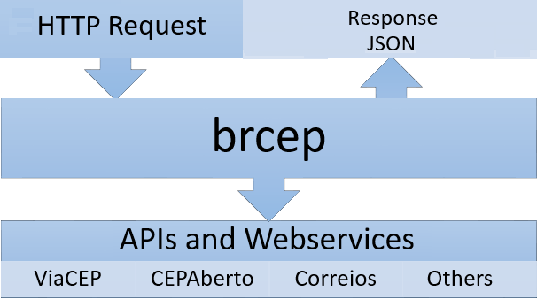

# brcep 

[](https://travis-ci.org/leogregianin/brcep) [](https://cloud.docker.com/repository/docker/leogregianin/brcep/builds) [](https://godoc.org/github.com/leogregianin/brcep) [](https://goreportcard.com/report/github.com/leogregianin/brcep) [](https://github.com/leogregianin/brcep/issues?q=is%3Aopen+is%3Aissue) [](https://github.com/leogregianin/brcep/issues?q=is%3Aissue+is%3Aclosed) [](https://codecov.io/gh/leogregianin/brcep) 
[](https://app.fossa.io/projects/git%2Bgithub.com%2Fleogregianin%2Fbrcep?ref=badge_shield)

API for accessing information from Brazilian CEPs. The central idea is not to be dependent on a specific API, but to have the ease of accessing __brcep__ and it is in charge of consulting various sources and returning the CEP information quickly and easily.

Currently we support API queries to [ViaCEP](http://viacep.com.br), [CEPAberto](http://cepaberto.com) and [Correios](https://apps.correios.com.br/). Your help is welcome to implement the `CepApi` interface and introduce new APIs support.



### Sidecar Pattern

The idea of this project is that you use the Docker image as a [sidecar](https://dzone.com/articles/sidecar-design-pattern-in-your-microservices-ecosy-1) for your current application. This project is not a library for consuming APIs, but a server that should run alongside (hence sidecar) your current application, and when you need to request a zip code, you will request the sidecar endpoint and not directly to an API. This gives you the advantage of middleware that will make the correct use of multiple APIs. 

Consider the docker-compose below to better understand:

```yaml
version: '2.1'

services:
  myapp:
    container_name: myapp
    build:
      context: .
      dockerfile: Dockerfile
    ports:
      - "3000:3000"
  brcep:
    image: brcep:latest
    ports:
      - "8000:8000"
    links:
      - myapp
    container_name: brcep
    environment:
      - PORT=8000
```

The idea is that your application runs on port 3000 and brcep runs on port 8000, considering the multiple [examples](./docs/examples.md) we have defined, replacing the URL with http://brcep/78048000/json. So your application now transparently consumes various APIs through brcep.

Topics
=================

  * [API example](#api-example)
  	* [Access](#access)
  	* [Response](#response)
  * [Execution](#Execution)
  	* [Environment Setting](#environment-setting)
  	* [Run with Docker](#run-with-docker)
  	* [Running locally](#running-locally)
  	* [Running tests](#running-tests)
  * [Examples](./docs/examples.md)
	* [Curl](./docs/examples.md#curl)
	* [Javascript](./docs/examples.md#javascript)
	* [Python](./docs/examples.md#python)
	* [Golang](./docs/examples.md#golang)
	* [Ruby](./docs/examples.md#ruby)
	* [PHP](./docs/examples.md#php)
	* [Java](./docs/examples.md#java)
	* [C#](./docs/examples.md#c-sharp)
	* [Delphi](./docs/examples.md#delphi)
  * [Use license](#use-license)


[](https://app.fossa.io/projects/git%2Bgithub.com%2Fleogregianin%2Fbrcep?ref=badge_large)

## API example

### Access

To make it easier to see what to expect from this project, the current version is available for viewing data at
[https://brcep-qnlohrjtbl.now.sh/78048000/json](https://brcep-qnlohrjtbl.now.sh/78048000/json).

### Response

```json
{
  "cep": "78048000",
  "endereco": "Avenida Miguel Sutil, de 5799/5800 a 7887/7888",
  "bairro": "Consil",
  "complemento": "",
  "cidade": "Cuiabá",
  "uf": "MT",
  "latitude": "-15.5786867",
  "longitude": "-56.0952081",
  "ddd": "",
  "unidade": "",
  "ibge": "5103403"
}
```

* The "CEP" field returns numbers only.
* The "complement", "latitude" and "longitude" fields may be left blank depending on the API queried.
* The remaining fields will always return values.

## Execution

### Environment Setting

* The CEPAberto API requires the authorization token and the ViaCEP API does not need the token.
* Rename the .env.example file to .env and include your CEPAberto.com API access token

## Running with Docker Hub

```bash
$ docker run \
    -e "BRCEP_ADDRESS=:8000" \
    -e "BRCEP_PREFERRED_API=viacep" \
    -p 127.0.0.1:8000:8000/tcp leogregianin/brcep
```

### Run with Docker from Local

Using Docker (`golang:alpine` image) with the command below the image will be compiled and executed on port `8000`. 

```sh
$ make run.docker
```

This will build the image with the name `leogregianin/brcep` and run it with the `.env.example` file if no `.env` file is present at the directory. To use other environment variables, please create a `.env` file next to the `.env.example` file.

To view data go to [http://localhost:8000/78048000/json](http://localhost:8000/78048000/json).

### Running locally

Since you have Golang 1.13 installed locally, the command below will download the dependencies and compile a binary for local execution.

```sh
$ make run.local
```

You can choose other architectures to build the binary if you need to deploy the binary to other systems:

```bash
$ make build.local
$ make build.linux.armv8
$ make build.linux.armv7
$ make build.linux
$ make build.osx
$ make build.windows
```

The above commands generate a binary in the `bin` folder.

### Running tests

```sh
$ make test
```

## Use license

See more details in [MIT License](LICENSE)